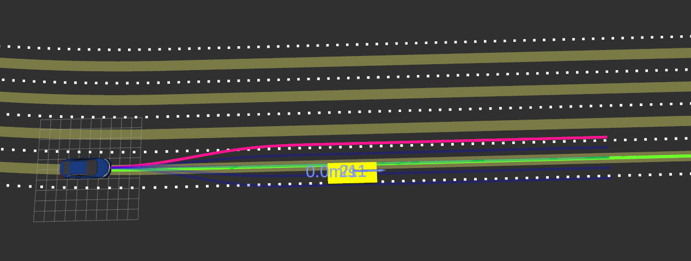

# lattice_planner

## Usage

```
roslauch lattice_planner lattice_planner.launch
```

**Example:**

Terminal 1: Under carla-setup,

```
./run_carla.sh
```

Terminal 2: Run an example scenario of highway following,

```
roslaunch demo_entrance scenario_loader_highway_following.launch
```


Terminal 3: Run lattice planner,

```
roslauch lattice_planner lattice_planner.launch
```

Terminal 4: Start scenario runner and load to stopped vehicle,

```
python scenario_runner.py --scenario HRIHighwayFollowing_4 --waitForEgo
```



## Parameter Tuning

The following parameters are tunable in the yaml file: [`config/params.yaml`](config/params.yaml).

ros

- `global_frame`: "map"
- `local_frame`: "ego_vehicle"

path planner

- `lookahead_distance`: 20.0
- `path_distance`: 50.0
- `num_paths`: 5 # pick from odd numbers [1,3,5,7]
- `lateral_offset`: The offset distance in lateral direction.
- `longitudinal_offset`: 4.0

collision checker

- `enable_collision_checker`: A flag whether using the collision checker.
- `circle_offsets`: Denote the circle positions. In default use `[-1.0, 1.0, 3.0]`.
- `circle_radii`: Denote the circle radius with default value `[1.5, 1.5, 1.5]`.
- `path_select_weight`: Not used in the code. Can be used when more cost functions are introduced.

velocity planner

- `enable_velocity_planner`: A flag whether using the default velocity planner.
- `cruise_speed`: Desired speed at cruise mode.
- `time_step`: Planning time step.
- `accel_max`: Maximum acceleration.
- `slow_speed`: The value marks when to change the planning strategy.

others

- `enable_obstacles_display`: A flag whether displaying detected objects in polygon array for debug purpose.

## Data Flow

### Input Topics

- `/casper_auto/ego_state`: The information of current state: position, orientation, vel and etc.
- `/casper_auto/global_route`: The route got the route planner.
- `/casper_auto/detected_objects`: The objects from perception in local frame.
- `/casper_auto/reference_lanes`: The information of the current and neighboring lanes.
- `/casper_auto/intention`: To be used. (TODO)
- `/casper_auto/target_lane_id`: The lane id of the target lane to reach.

### Output Topics

- `/casper_auto/selected_path`: Selected path.
- `/casper_auto/generated_paths`: Display all the generated paths with selected one in pink.
- `/casper_auto/final_waypoints`: Only available when velocity_planner is enabled.

## Running in Parallel Mode

The param `run_parallel` indicates the planner generate the paths in parallel or in sequential.

| Parallel Mode on | Parallel Mode off |
|--|--|
| Elapsed time: 6.6630 milliseconds | Elapsed time: 15.3220 milliseconds |
