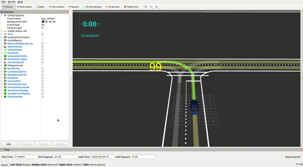

# Message Translator

## 1. Region of Interest

Run

```
roslaunch region_of_interest region_of_interest.launch
```

or

```
roslaunch region_of_interest region_of_interest_format.launch
```

## 2. Lane Line Publisher


```
roslaunch region_of_interest lane_line_publisher.launch
```

## 3. Stop Sign Processor


```
roslaunch region_of_interest stop_sign_processor.launch
```


